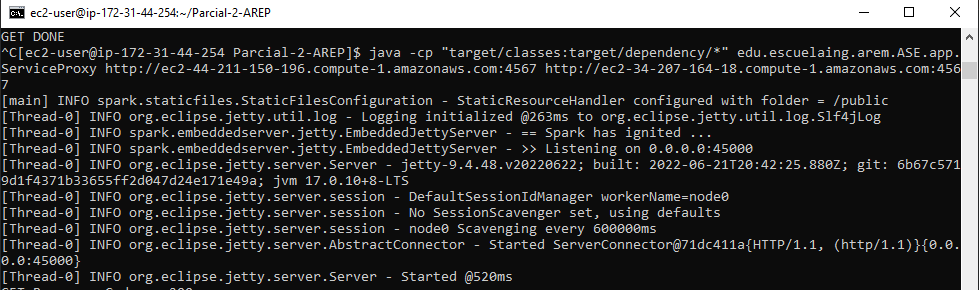

### Escuela Colombiana de Ingeniería

### Arquitecturas Empresariales


#### PARCIAL 2

#### Santiago Arévalo Rojas

### Requisitos para ejecución
* 3 instancias EC2 de AWS con Java (mínimo java 8), git y maven instalados.

### Instrucciones para ejecución
* Iniciamos clonando el repositorio de github a cada una de las tres instancias de EC2, del link [https://github.com/santiarojas18/Parcial-2-AREP.git](https://github.com/santiarojas18/Parcial-2-AREP.git) con el comando ```git clone https://github.com/santiarojas18/Parcial-2-AREP.git```.  
* Seguido a esto procedemos a compilar el proyecto con el comando ```mvn clean install```.  
* Luego debemos elegir dos instancias de EC2 para que sean los servidores MathServices, así que ahora ejecutamos en cada una de estas 2 máquinas el comando ```java -cp "target/classes:target/dependency/*" edu.escuelaing.arem.ASE.app.MathServices```, así deben lucir nuestras dos instancias:  
      
* Ahora procederemos a encender el servidor proxy con el comando ```java -cp "target/classes:target/dependency/*" edu.escuelaing.arem.ASE.app.ServiceProxy {DNS Instancia EC2 MathService1:port} {DNS Instancia EC2 MathService2:port}```, en este caso en específico lo hice con el comando ```java -cp "target/classes:target/dependency/*" edu.escuelaing.arem.ASE.app.ServiceProxy http://ec2-44-211-150-196.compute-1.amazonaws.com:4567 http://ec2-34-207-164-18.compute-1.amazonaws.com:4567```. Evidenciamos que el servidor está corriendo:
      
* Con nuestros servidores corriendo podemos ahora si ingresar al front del usuario, esto por medio de la DNS del servidor que está ejecutando el ServiceProxy, en mi caso a la URL [http://ec2-3-90-174-148.compute-1.amazonaws.com:45000/index.html](http://ec2-3-90-174-148.compute-1.amazonaws.com:45000/index.html), viendo la siguiente página web:  
      
* Y probamos los servicios, primero solicitamos los Factores, en el primer caso con 112 y el segundo con 15:  
      
      
* Ahora probamos la calculadora de primos, en primera instancia hasta el 100 y luego el caso base que es 1, en este no debería salir ningún número: 
      
      

### Información del diseño
* Se implementó la siguiente arquitectura propuesta:
      
* Para realizar el ServiceProxy y el MathServices se crearon dos clases que utlizan la librería Spark para el manejo de las peticiones, en esta primera clase para lograr que el puerto y las Url de los MathServices fueran dinámicas se realizó por medio de variables de entorno. Para el caso del puerto se puede modificar directamente por medio de la variable de entorno PORT y luce así el código:  
      
* Y para indicar las URL se envian por parámetro al momento de ejecutar la aplicación, para setearlo se hace en el main:  
      
* Y el algoritmo para roundrobin se hace con el método:  
      
* Además, para comunicar el Proxy con los dos servidores de MathServices se crea la clase HttpConnection y al recibir una petición se dirige esta al servidor definido según el algoritmo. El llamado se ve asi:  
      
* En MathService vemos la implementación de la lógica:  
      
* Finalmente el servidor Proxy es el que ofrece los archivos estáticos index.html y scripts.js para el cliente se pueda conectar.  

### Video
* Demostración de funcionamiento en las 3 instaciones de EC2:  
    [video.mp4](img/video.mp4)